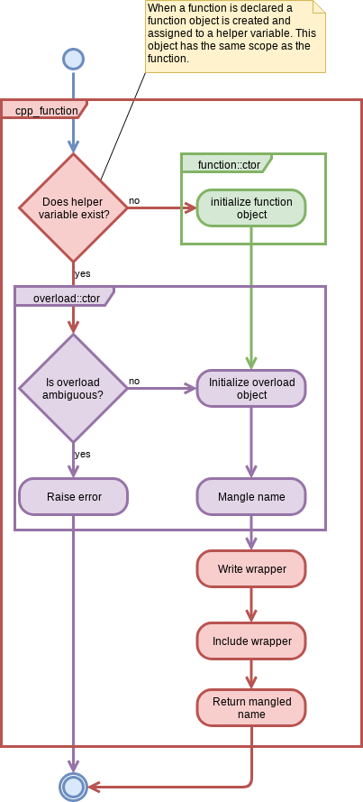

*******************************
CMakePP Function Implementation
*******************************

.. note::

   Since `cpp_function` does not appear to exist anymore, this page is not 
   included in the documentation.

This page describes how functions work in the CMakePP language.

What it Looks Like to the User
==============================

To frame our developer discussion let's reiterate how CMakePP functions look to
users of the CMakePP language. To that end, let's assume our user is declaring 
a function ``foo``, which takes an ``int`` and a ``bool``. For this scenario, 
the user writes code something akin to:

.. code-block:: cmake

   include(cmakepp_lang/function/function)

   cpp_function(foo int bool)
   function(${foo} arg0 arg1)
       # Implement the foo(int, bool) function
   endfunction()

When this code is run it will introduce a function ``foo`` into the current
scope. It is expected that users will be writing CMakePP functions in CMake
modules, hence usage of ``foo`` looks something like:

.. code-block:: cmake

   include(path/to/foo/module)

   foo(3 TRUE)

It bears mentioning that functions in the CMakePP language can be variadic and 
they can be overloaded for different numbers/types of positional arguments.

Implementation
==============

Like C++, each overload of a function is actually mapped to a unique name. The
process of mapping overloads to unique names is called **name mangling**. It 
is the mangled name that is returned from `cpp_function`. Hence, when a user 
does:

.. code-block:: cmake

   cpp_function(foo int)
   function("${foo}" arg0)
   endfunction()

What they are really doing is defining a function whose name is the mangled
name. In order to give the user the illusion of overloads, as part of
`cpp_function`, the CMakePP language creates a wrapper function ``foo`` whose 
contents are:

.. code-block:: cmake

   macro(foo)
       _cpp_function_call_overload("foo" ${ARGN})
   endmacro()

This wrapper ultimately mangles the name of the function with the arguments,
then uses the initializer function pattern to call the implementation defined
under the mangled name.

Determining the mangled name is a little bit tricky because the same set of
objects could conceivably be given to multiple overloads. For example, calling 
``foo(3 hello)`` could be perceived as trying to call ``foo(int desc)``,
``foo(int args)``, or ``foo(args)``. While the CMakePP language forbids the 
user from defining more than one of these overloads at any given time, we 
still need to know which overload the user defined. Rather than try all of the 
possible overloads (the number of which grows linearly with the number of 
arguments, ignoring implicit casts, or exponentially when we need to try 
combinations of implicit casts) the CMakePP language simply keeps a record of 
the overloads the user has defined so far for the function. This record is held 
in a global map whose keys are the types provided to the signature and the 
values are the mangled names. In practice, users tend to only define a couple 
overloads for a function so we only need to consider an approximately constant 
number of overloads.

The process is summarized in the following UML diagram.

Understanding Ambiguities
=========================

The largest problem with allowing overloads and variadic functions is that it
becomes possible for a given set of arguments to resolve to more than one
overload. We say two overloads of a function, :math:`O_a` and :math:`O_b`, are
ambiguous if the same set of arguments constitutes a valid input for either
:math:`O_a` or :math:`O_b`. The purpose of this section is to work out the
scenarios under which :math:`O_a` and :math:`O_b` are ambiguous. To that end,
note that a non-variadic overload which takes :math:`n` arguments can be thought
of as an ordered :math:`n`-tuple such that the :math:`i`-th element in the tuple
is the type of the :math:`i`-th positional argument. A variadic overload with
:math:`(n-1)` required positional arguments can also be mapped to an
:math:`n`-tuple such that the first :math:`(n-1)` elements of the tuple are the
types of the required positional arguments and the :math:`n`-th element is an
opaque object holding the provided variadic arguments.

Without loss of generality, we assume that our two overloads, :math:`O_a` and
:math:`O_b` respectively take :math:`n` and :math:`m` total arguments such that
:math:`n\le m`. As previously discussed, variadic arguments, if present, are
wrapped into a single opaque object. For variadic functions, the opaque object 
is always the last element of the tuple. The first :math:`\ell` elements of a 
tuple will be denoted with a superscript, for example the first :math:`\ell` 
elements of :math:`O_a` are denoted :math:`O_a^{(\ell)}`.

If :math:`n` equals :math:`m`, there exists a trivial ambiguity when
:math:`O_a^{(n)}` equals :math:`O_b^{(m)}`, *i.e.*, the overloads are exactly
the same signature. For non-variadic functions this looks something like:

.. code-block:: cmake

   # Overload a with n == 2
   cpp_function(a_fxn int bool)
   function("${a_fxn}" arg0 arg1)
       # Implementation goes here
   endfunction()

   # Overload b with m == 2
   cpp_function(a_fxn int bool)
   function("${a_fxn}" arg0 arg1)
       # Implementation goes here
   endfunction()

and for two variadic functions this looks like:

.. code-block:: cmake

   # Overload a with n == 2
   cpp_function(a_fxn int args)
   function("${a_fxn}" arg0)
       # Implementation goes here
   endfunction()

   # Overload b with m == 2
   cpp_function(a_fxn int args)
   function("${a_fxn}" arg0)
       # Implementation goes here
   endfunction()

For :math:`n == m`, there additionally exists one non-trivial ambiguity when
either :math:`O_a` or :math:`O_b` is variadic (if both are variadic only the
trivial ambiguity exists). If we arbitrarily take :math:`O_a` as being variadic
then, for :math:`n == m`, if :math:`O_a^{(n-1)}` are the same as
:math:`O_b^{(n-1)}` an ambiguity occurs. More concretely consider the following:

.. code-block:: cmake

   # Overload a
   cpp_function(a_fxn int bool args) # n == 3
   function("${a_fxn}" arg0 arg1)
   endfunction()

   # Overload b
   cpp_function(a_fxn int bool path) # m == 3
   function("${a_fxn}" arg0 arg1 arg2)
   endfunction()

Here we can not distinguish a call to overload :math:`O_b` from a call to
overload :math:`O_a` with the ``path`` argument passed through ``args``. In fact,
as long as overload :math:`O_a` is variadic, this ambiguity is actually present
for any value of :math:`n`. For example in:

.. code-block:: cmake

   # Overload a
   cpp_function(a_fxn int args) # n == 2
   function("${a_fxn}" arg0)
   endfunction()

   # Overload b
   cpp_function(a_fxn int bool path) # m == 3
   function("${a_fxn}" arg0 arg1 arg2)
   endfunction()

we can not distinguish a call to overload :math:`O_b` from a call to overload
:math:`O_a` with a ``bool`` and a ``path`` passed as ``args``.

So far we have accounted for all ambiguities when :math:`O_a` is variadic. If
both :math:`O_a` and :math:`O_b` are non-variadic, then only the trivial
ambiguity is possible. If :math:`O_a` is non-variadic, but :math:`O_b` is
variadic an additional ambiguity occurs when :math:`m = n + 1` and
:math:`O_a^{(n)} == O_b^{(m-1)}`. This looks like:

.. code-block:: cmake

   # Overload a
   cpp_function(a_fxn int bool) # n == 2
   function("${a_fxn}" arg0 arg1)
   endfunction()

   # Overload b
   cpp_function(a_fxn int bool args) # m == 3
   function("${a_fxn}" arg0 arg1)
   endfunction()

Here we can not distinguish a call to :math:`O_a` from a call to :math:`O_b`
with no variadic arguments. These ambiguities are summarized in the following
table.

+---------------------------+------------------------------------+
| Variadic?                 | Ambiguous when:                    |
+-------------+-------------+                                    +
| :math:`O_a` | :math:`O_b` |                                    |
+=============+=============+====================================+
| Yes         | Yes         | :math:`O_a^{(n-1)} == O_b^{(n-1)}` |
+-------------+-------------+------------------------------------+
| Yes         | No          | :math:`O_a^{(n-1)} == O_b^{(n-1)}` |
+-------------+-------------+------------------------------------+
| No          | Yes         | :math:`O_a^{(m-1)} == O_b^{(m-1)}` |
+-------------+-------------+------------------------------------+
| No          | No          | :math:`O_a^{(n)} == O_b^{(m)}`     |
+-------------+-------------+------------------------------------+
