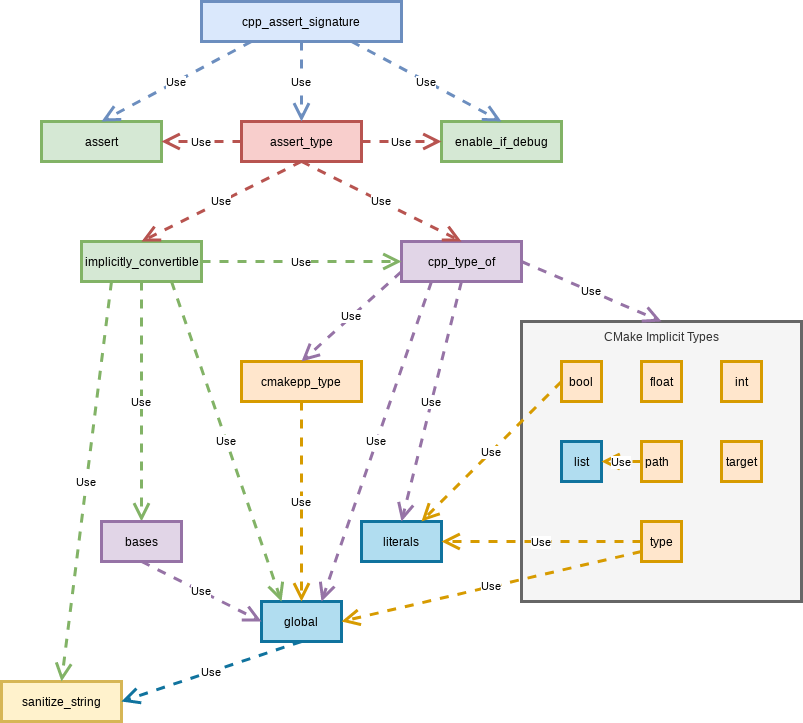

.. Copyright 2023 CMakePP
..
.. Licensed under the Apache License, Version 2.0 (the "License");
.. you may not use this file except in compliance with the License.
.. You may obtain a copy of the License at
..
.. http://www.apache.org/licenses/LICENSE-2.0
..
.. Unless required by applicable law or agreed to in writing, software
.. distributed under the License is distributed on an "AS IS" BASIS,
.. WITHOUT WARRANTIES OR CONDITIONS OF ANY KIND, either express or implied.
.. See the License for the specific language governing permissions and
.. limitations under the License.

.. _unit-testing-cmakepplang-functions:

**********************************
Unit Testing CMakePPLang Functions
**********************************

This page contains guidelines, tips, and tricks which relate to unit testing
functionality in the CMakePPLang module. The content of this page is somewhat
exclusive to CMakePPLang and is in addition to project-wide guidelines.

Testing Signatures
==================

The CMake language is weakly typed, while CMakePPLang is strongly typed.
Because CMakePPLang is unit tested, users can be confident that CMakePPLang
functions will correctly enforce type safety (and if they don't, that is a
bug). Unfortunately, this means that all code intended to implement
CMakePPLang's type-safety mechanism need to have their type-safety checked
manually. This section focuses on how to unit test such code.

cpp_assert_signature
--------------------

CMakePPLang provides the function ``cpp_assert_signature`` to facilitate the
testing of signatures. ``cpp_assert_signature`` does the actual type-checking
for you. In your unit test, simply make sure you are calling
``cpp_assert_signature`` correctly. Type-checking is only performed 
in debug mode, so ``CMAKEPP_LANG_DEBUG_MODE`` must be toggled on when testing
function signatures as well. Due to the performance drop that debugging mode
can cause, it should only be enabled in the scopes where it is needed. See
:ref:`debugging` for more information.

As an example of using ``cpp_assert_signature``, consider the implementation
of a function with the signature ``my_function(desc bool)``. This would look
like:

.. literalinclude:: /../../tests/docs/source/developer/unit_testing.cmake
   :lines: 3-8

The basic pattern is that your function's first line should call
``cpp_assert_signature`` with the arguments provided to your function (this is
always ``"${ARGV}"``) and the types that each argument should be (of course you
should use your function's actual types). To make sure you are calling
``cpp_assert_signature``, your unit-test should look like:

.. literalinclude:: /../../tests/docs/source/developer/unit_testing.cmake
   :lines: 1-2, 10-35

This is boilerplate heavy, but it is also the minimum required to
make sure that you have correctly set the types of each argument and that your
function is not variadic (in this example we did not define our function as
variadic; if yours is variadic you can skip this check).

Functions that cannot be type-checked with cpp_assert_signature
---------------------------------------------------------------

The following UML diagram summarizes the call graph of ``cpp_assert_signature``.

Caveats regarding recursion aside, the call graph of any CMake script must
ultimately be a directed-acyclic graph. This means we cannot use
``cpp_assert_signature`` to type-check any of the signatures of the functions
used to implement it. More generally, with respect to the above UML diagram,
each function in the diagram can only use functions below it to implement
type-checking. For example, ``sanitize_string`` cannot use any function in the
call-graph to implement its type-checking (because all functions in the graph
depend on ``sanitize_string``), whereas ``cmakepp_type`` can use functions in
the ``global`` module as well as ``sanitize_string`` (which is not very helpful
in the long run for this particular use case). For the most part, many of these
functions are quite generic (operating on objects of type ``str`` in many cases)
so type-checking is not particularly useful anyways (think of ``str`` as
``void*`` in C/C++). At the moment, for better or for worse, most of these
functions in this call graph have no type-checking.
