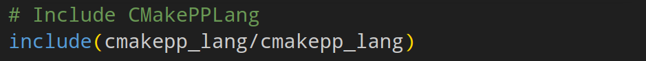

# Summary

CMakePPLang is an object-oriented extension to the CMake language written
entirely using the original CMake language
with the goal of making projects built on CMake easier to create and maintain.
That said, CMakePPLang has different coding practices, paradigms, and standards than the original CMake language,
much in the same way that
C\nolinebreak[4]\hspace{-.05em}\raisebox{.4ex}{\tiny\bf ++} coding differs from
C coding despite some level of interoperability.
Currently, CMakePPLang is used within the CMakePP organization [@cmakepp_org] as
the foundation for two in-progress projects: CMakeTest [@cmaketest] and CMaize [@cmaize]. CMakeTest
provides a solution for unit testing CMake and CMakePPLang code. CMaize
is a CMake tool to simplify interoperability between projects and writing
their build systems.

# Statement of Need

CMake [@cmake] is an extensible build tool that exceeds at generating build
systems
for many combinations of platforms, compilers, and build configurations.
CMake has become the *de facto* standard tool for building C,
C\nolinebreak[4]\hspace{-.05em}\raisebox{.4ex}{\tiny\bf ++}, and
Fortran programs of moderate to large size. However, as the size of a project
increases, the complexity of the CMake build code tends to increase as well,
and the need arises to make building projects with CMake easier and less
error prone. The complexity of builds will also increase as scientific
computing moves toward heterogeneous systems, requiring programs to leverage
a combination of CPUs, GPUs, and other specialized hardware [@richard_pluginplay_2023].  Better
utilities and extensions in CMake can help alleviate these issues, but these
tools must be able to be designed in a maintainable and testable way [@pressman_142_2005].
 Object-oriented programming excels at managing and
maintaining large, complex code bases [@wirth_good_2006; @ambler_realistic_1998],
and there is an increasing need for this in the CMake language.

Tobias Becker [@becker_cmake_2021] recognized these issues and wrote a purely object-oriented
language on top of CMake, called
CMake\nolinebreak[4]\hspace{-.05em}\raisebox{.4ex}{\tiny\bf ++} (formerly oo-cmake).
CMake\nolinebreak[4]\hspace{-.05em}\raisebox{.4ex}{\tiny\bf ++} contains an abundance of CMake extensions. Many of those extensions
have direct overlap with extensions that are part of CMakePPLang. Features
include (among many): maps, objects, tasks/promises. Unfortunately development
of CMake\nolinebreak[4]\hspace{-.05em}\raisebox{.4ex}{\tiny\bf ++} has largely
been done by a single developer and it appears to have been
abandoned, as there have only been two commits since July 2017, both in 2021.

One of the primary issues with
CMake\nolinebreak[4]\hspace{-.05em}\raisebox{.4ex}{\tiny\bf ++} is the lack of documentation. While
there is some high-level documentation, there is little to no API or detailed
developer documentation. This makes it very challenging for a new developer to figure out
what is going on. Initially, forking and expanding on
CMake\nolinebreak[4]\hspace{-.05em}\raisebox{.4ex}{\tiny\bf ++}  was
considered, but it was determined that it would take similar time to
decipher CMake\nolinebreak[4]\hspace{-.05em}\raisebox{.4ex}{\tiny\bf ++} as it would to develop CMakePPLang.

CMakePPLang has been developed to provide extensions to the CMake language
which provide objected-oriented functionality and other quality-of-life
improvements. The main features of CMakePPLang are the object-oriented
functionality, strong data typing, addition of a map structure, and
backwards-compatibility with CMake. These features allow for easier general
programming in CMake, which is key to writing complex build tools in the
language. Although CMakePPLang is built on top of CMake, CMakePPLang mostly
relies on fairly fundamental features of the CMake language, so it is
versioned independently of CMake using semantic versioning [@semver].

# Basic Usage

CMakePPLang is developed using CMake, so it is inherently backwards-compatible
with CMake code and can be combined with CMake in the same `CMakeLists.txt`
or `*.cmake` files. To use CMakePPLang, it is simply included like any
other CMake module after it is downloaded (\autoref{fig:include_cmakepplang}).

{width=60%}

Native CMake is a weakly typed language where all values are strings, and,
in certain circumstances, select values are interpreted as being of another
type. A common example is when a string is used as an argument to CMake’s `if`
statement, where the string is implicitly cast to a boolean. In practice, this
weak typing can lead to subtle, hard-to-detect errors. CMakePPLang implements
strong-typing in order to avoid/catch such errors. An example of weak typing
causing issues is the ambiguity when passing a list as an argument to a
function, which many CMake users are likely familiar with. In CMake's
`list(LENGTH` function, there are three different ways to pass a list to the
function, yielding three different results as seen in \autoref{fig:cmake_list_length}.
Looking at the function signature, `list(LENGTH <list> <output variable>)`
 [@cmake_list_length], it is unclear which version to use without trial and error.
Conversely, using strong typing with CMakePPLang (\autoref{fig:cmakepplang_list_length}),
it is immediately clear that the variable pointing to the list should be used
from the types of the signature, `cpp_list(LENGTH cpp_list list* int*)`, where
`list*` is a pointer to a list (colloquially it is the variable containing a
list) and `int*` is a pointer to an integer where the resulting length will be
stored. The other options now throw errors that prompt the user to reconsider
the function signature and types being passed in.

{width=60%}

{width=60%}

CMakePPLang conceptually
has three classifications of types: CMake types, Quasi-CMake types, and
pure CMakePPLang types.

First, CMakePPLang recognizes the types that CMake may interpret a
string to be in certain contexts. These types include: Boolean, Command,
File path, Floating-point numbers, Generator expressions, Integers, and
Targets.

Quasi-CMake types are types which conceptually exist in traditional CMake,
but are not explicitly defined. These types are: Description and Type.
Descriptions are the subset of strings that have no other intrinsic type aside from being a string, *i.e.*, they can only be interpreted as text. Types are string values used to represent the type of an object, in CMakePPLang they amount to strings reserved for the in-code keywords representing a type,
like `str` for a string, `int` for an integer, and `desc` for a description.

CMakePPLang also defines types that are outside of what can easily be
represented in CMake: Class, Map, and Object. The Class type is used for
objects which hold the specification of a user-defined type. Classes in
CMakePPLang can contain attributes and functions and support inheritance.
Instances of these user-defined classes can be created to be used in CMake
modules. Currently, Classes are represented using Maps. An object of the
Map type is an associative array for storing key-value pairs. The CMakePPLang
Map provides the same basic functionality as a
C\nolinebreak[4]\hspace{-.05em}\raisebox{.4ex}{\tiny\bf ++} `std::map` [@cpp_stdmap_2023], Python
`dictionary`[@python_map_2023], or JavaScript `Map` [@javascript_map_2023].
Users can use maps in
their code wherever they see fit, and maps are used in CMakePPLang to hold the
state of object instances. Finally, the Object type is the base class for all
user-defined classes. The CMakePPLang Object defines the default
implementations for the equality, copy, and serialization functionalities.

CMakePPLang is designed primarily to provide object-oriented funcionality
for tools designed in CMake. The first step in this process is defining a
class (\autoref{fig:class_example}). Strong typing of the member function
parameters can be seen in the example as well.

{width=75%}

Users can also define a map to hold information, like a map that stores a
color value under the "color" key (\autoref{fig:map_example}), along with
other relevant values.

{width=60%}

Using these tools, CMakePPLang users can leverage the benefits of object-
oriented programming to create more easily maintainable and testable utilities
for CMake development.

# Acknowledgement

This research was supported by the Exascale Computing Project (17-SC-20-SC), a collaborative
effort of the U.S. Department of Energy Office of Science and the National Nuclear Security Administration.
The software was developed in the NWChemEx subproject and the research was performed at the Ames National Laboratory,
which is operated for the US DOE by Iowa State University under [Contract No. DE-AC02-07CH11358].

# References
